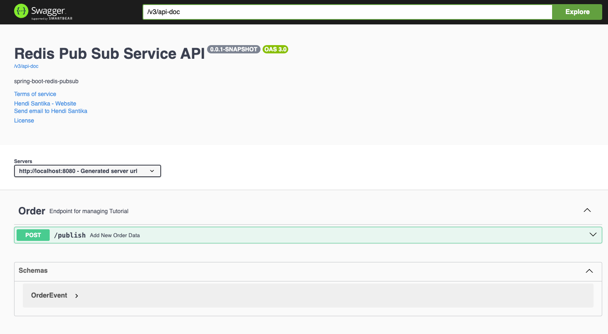

# spring-boot-redis-pubsub

### Things todo list

1. Clone this repository: `git clone https://github.com/hendisantika/spring-boot-redis-pubsub.git`
2. Navigate to the folder: `cd spring-boot-redis-pubsub`
3. Run the application: `mvn clean spring-boot:run`
4. Open your favorite browser: http://localhost:8080/swagger-ui

### Image Screenshot

Swagger UI



Curl

```shell
curl -X 'POST' \
  'http://localhost:8080/publish' \
  -H 'accept: application/json' \
  -H 'Content-Type: application/json' \
  -d '{
  "orderId": "ORD0001",
  "userId": "USER0001",
  "productName": "Buku Sinar Dunia",
  "price": 5000,
  "quantity": 10
}'
```
